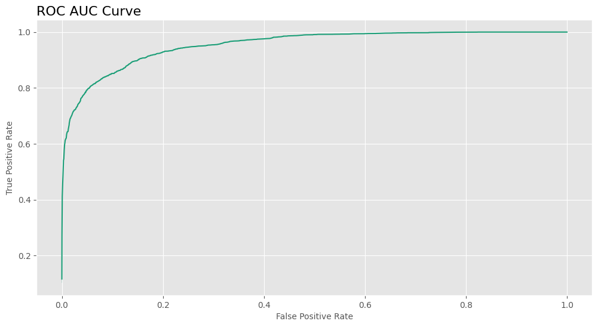
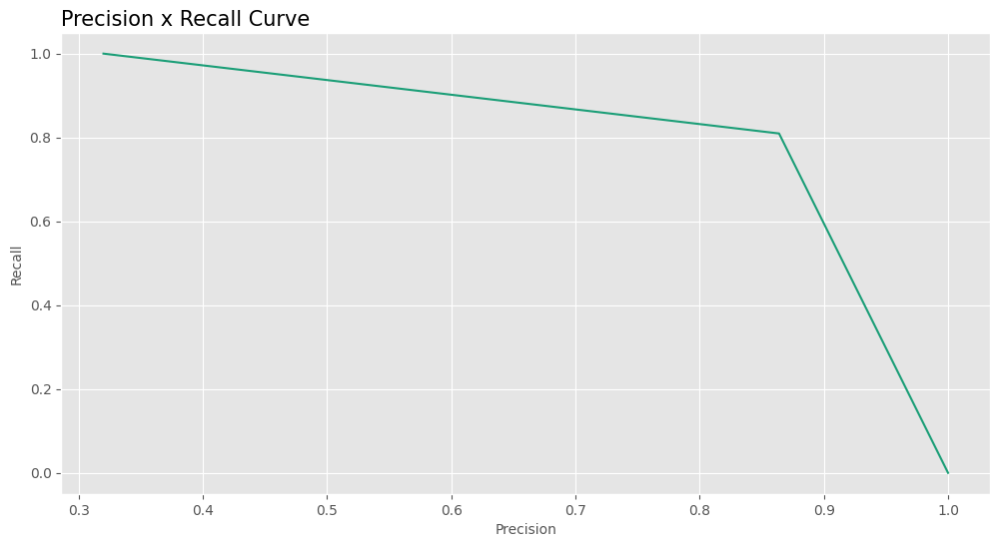
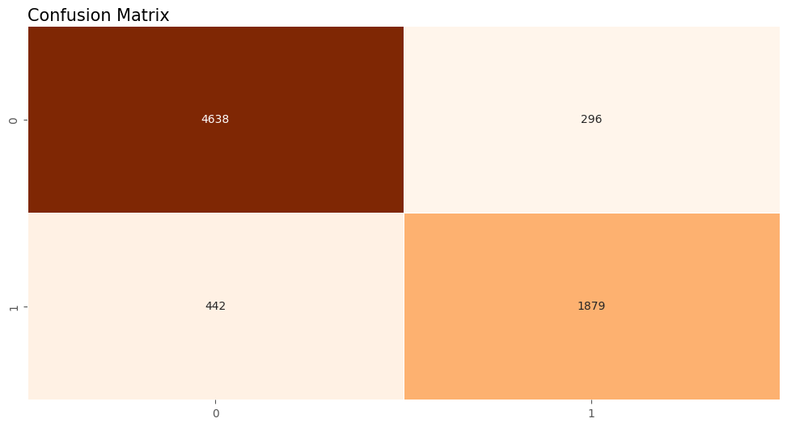

# Hotel Booking Status Prediction 🏨

## Content
- [Introduction](#introduction)
- [Goals](#goals)
- [Data](#data)
- [Modeling tools](#modeling-tools)
- [Results](#results)
- [Tools](#tools)

## Introduction
The online hotel reservation channels have dramatically changed booking possibilities and customers’ behavior. A significant number of hotel reservations are called-off due to cancellations or no-shows. The typical reasons for cancellations include change of plans, scheduling conflicts, etc. This is often made easier by the option to do so free of charge or preferably at a low cost which is beneficial to hotel guests but it is a less desirable and possibly revenue-diminishing factor for hotels to deal with.

## Goals
So the goals of this project is (1) explore data to find insights about cancelations, and (2) to build a machine learning model capable of predicting cancelations or no-shows beforehand. 

## Data
| **Feature**| **Description**|
|---|---|
|**Booking_ID**| Unique identifier of each booking|
|**no_of_adults**| Number of adults|
|**no_of_children**| Number of children|
|**no_of_weekend_nights**| Number of weekend nights (Saturday or Sunday) the guest stayed or booked to stay at the hotel|
|**no_of_week_nights**| Number of week nights (Monday to Friday) the guest stayed or booked to stay at the hotel|
|**type_of_meal_plan**| Type of meal plan booked by the customer|
|**required_car_parking_space**| Does the customer require a car parking space? (0 - No, 1 - Yes)|
|**room_type_reserved**| Type of room reserved by the customer. The values are ciphered (encoded) by INN Hotels|
|**lead_time**| Number of days between the date of booking and the arrival date|
|**arrival_year**| Year of arrival date|
|**arrival_month**| Month of arrival date|
|**arrival_date**| Date of the month|
|**market_segment_type**| Market segment designation|
|**repeated_guest**| Is the customer a repeated guest? (0 - No, 1 - Yes)|
|**no_of_previous_cancellations**| Number of previous bookings that were canceled by the customer prior to the current booking|
|**no_of_previous_bookings_not_canceled** | Number of previous bookings not canceled by the customer prior to the current booking|
|**avg_price_per_room**| Average price per day of the reservation; prices of the rooms are dynamic (in euros)|
|**no_of_special_requests**| Total number of special requests made by the customer (e.g. high floor, view from the room, etc)|
|**booking_status**| Flag indicating if the booking was canceled or not|

This dataset is available in [Kaggle](https://www.kaggle.com/datasets/ahsan81/hotel-reservations-classification-dataset) and was uploaded by Ahsan Raza.

## Modeling tools
#### Preprocessing
- Scikit-learn, Optuna, Category Encoders, Feature Engine.
#### Model
- LightGBM.
#### Metrics
- Accuracy, F1 Score, ROC AUC. 

## Results
### Exploratory Data Analysis insights
- Reservations with long lead times need to be closely tracked. Simple actions like periodic confirmation messages or emails can be a good plan, as we've seen that the probability of cancellation starts to rise with longer lead times.
- A higher number of children increases the probability of cancellation, so this is also something to keep track of.
- Room Type 1 is the most popular, while Room Type 6 has the highest number of cancellations.
- The Online segment is the most popular and also has the highest cancellation rate. The Complementary and Corporate segments have the lowest cancellation rates, so it may be a good idea to reward them.

### Classification model
#### Metrics
|Metric|Result|
|---|---|
|**Accuracy**| 0.8983|
|**F1 Score**| 0.8359|
|**ROC AUC**| 0.9539|

#### Cross-validation
|Stat|Result|
|---|---|
|**Mean F1 Score**| [0.83842795 0.82335766 0.83083512 0.83543392 0.83062477]|
|**General Mean F1 Score**| 0.8317|
|**F1 Score Standard Deviation**| 0.0051|

#### Visualizations

## Tools 

## Contact
- **E-mail**: andreluizlcons@gmail.com
- **LinkedIn**: https://www.linkedin.com/in/andreluizls1/
- **Phone** +55 88 999934237